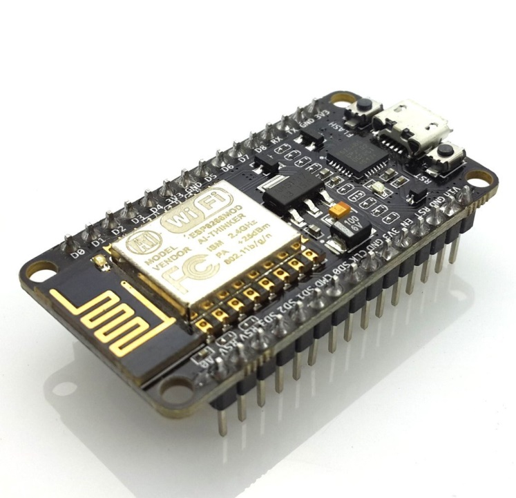

# Welcome to my page

## Table of Contents
* [Introduction](#introduction)
* [Aim and Objective](#aim-and-objective)
* [Expected outcome](#expected-outcome)
* [Materials Required](#materials-required)
  * [Wifi Module](#wifi-module)
  * [Relay Module](#relay-module)
  
  
## Introduction
In this project we are going to make a home automation system using ESP8266 Wi-Fi module. Using this we will be able to control lights, electric fan and other home appliances through a web browser using our PC or mobile. These AC mains appliances will be connected to relays which are controlled by the ESP8266. ESP8266 acts as a Web Server and we will send control commands through a Web Browser like Google Chrome or Mozilla Firefox. ESP8266 is the one of the most popular and low cost Wi-Fi module available in the market today.

## Aim and Objective
The main Objective of our work is to automate the Home Appliances using Android Application or the Computer, basically the project is very much important for Specially challenged People who are unable to go everywhere every time to control the home appliances, for that they can be in one position and can control the home appliances.

Also for the people who are sleeping at night and are feeling lazy to either switch off/on the fan or A.C. or any of the home appliances they can turn on/off using there android phone.

Some times in this busy world people generally forget to switch off there fan or light or any home appliance in hurry while leaving home in that case they can also turn on/off it after leaving the home using there Android Application.

Also, for the parents who fear of getting electric shocks if their children use the switch, then in that case too our project work is very useful as the child can control the home appliances using the Android Application and is safe for electric shocks.

## Expected outcome
The home appliances can be controlled with any android mobile or web browser anywhere, anytime. 
The user will have application which will allow easier operation of wifi module.
And also a webpage which will control over wifi module, if not have android mobile.
It can be controlled with any computer.

# Materials Required

## Wifi Module

This is a Wi-Fi module which we are using in our project. Its model is “Esp8266mod” and vendor is “Ai-Thinker”. It’s an impressive, low cost Wi-Fi module suitable for adding Wi-Fi functionality to an existing microcontroller project via a UART serial connection. The module can even be reprogrammed to act as a standalone Wi-Fi connected device–just add power.

### Configuration of esp module
1.	Input Voltage = 5v
2.	Output Voltage=3.3v
3.	It has 16 GPIO pins,can be used for both input and output.
4.	It can be used as standalone module i.e no additional programmer needed to program this board.
5.	It can work in 3 modes
i)	Station Mode  :	It can connect to existing Wi-Fi Access Points.
ii)	Soft-AP Mode:	It can create Wi-Fi Access Points.
iii)	It is also able to operate both in station mode and soft Access Point Mode at the same point.

### why this module
1.Fully integrated module i.e inbuilt with programmer.
2.Can be powered by any usb cable mobile charger.
3.Easily programmed by using Arduino IDE.
4.Very low Power consumption.
5.Cost Effective.
6.Easily available in Online Shopping websites such as Amazon and Ebay.

### Pin diagram of esp

