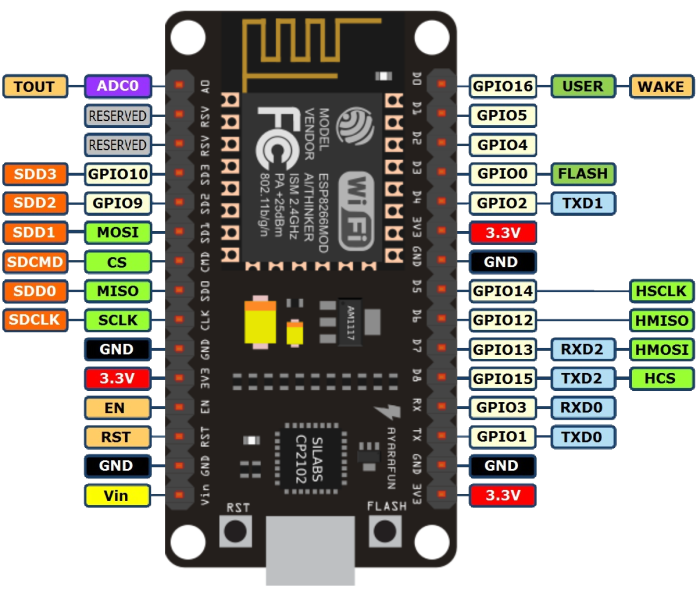
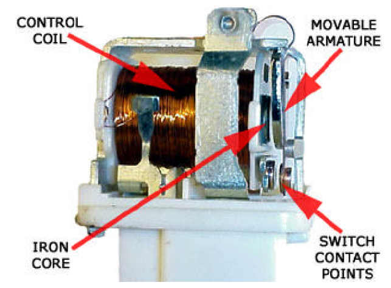
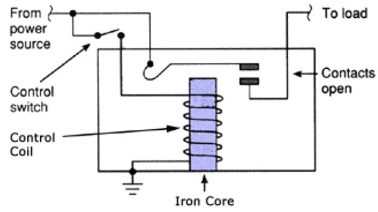

# Welcome to my page

## Table of Contents
* [Introduction](#introduction)
* [Aim and Objective](#aim-and-objective)
* [Expected outcome](#expected-outcome)
* [Materials Required](#materials-required)
  * [Wifi Module](#wifi-module)
  * [Relay Module](#relay-module)
  
  
## Introduction
In this project we are going to make a home automation system using ESP8266 Wi-Fi module. Using this we will be able to control lights, electric fan and other home appliances through a web browser using our PC or mobile. These AC mains appliances will be connected to relays which are controlled by the ESP8266. ESP8266 acts as a Web Server and we will send control commands through a Web Browser like Google Chrome or Mozilla Firefox. ESP8266 is the one of the most popular and low cost Wi-Fi module available in the market today.

## Aim and Objective
The main Objective of our work is to automate the Home Appliances using Android Application or the Computer, basically the project is very much important for Specially challenged People who are unable to go everywhere every time to control the home appliances, for that they can be in one position and can control the home appliances.

Also for the people who are sleeping at night and are feeling lazy to either switch off/on the fan or A.C. or any of the home appliances they can turn on/off using there android phone.

Some times in this busy world people generally forget to switch off there fan or light or any home appliance in hurry while leaving home in that case they can also turn on/off it after leaving the home using there Android Application.

Also, for the parents who fear of getting electric shocks if their children use the switch, then in that case too our project work is very useful as the child can control the home appliances using the Android Application and is safe for electric shocks.

## Expected outcome
The home appliances can be controlled with any android mobile or web browser anywhere, anytime. 
The user will have application which will allow easier operation of wifi module.
And also a webpage which will control over wifi module, if not have android mobile.
It can be controlled with any computer.

# Materials Required

## Wifi Module

This is a Wi-Fi module which we are using in our project. Its model is “Esp8266mod” and vendor is “Ai-Thinker”. It’s an impressive, low cost Wi-Fi module suitable for adding Wi-Fi functionality to an existing microcontroller project via a UART serial connection. The module can even be reprogrammed to act as a standalone Wi-Fi connected device–just add power.

### Configuration of esp module
1.	Input Voltage = 5v
2.	Output Voltage=3.3v
3.	It has 16 GPIO pins,can be used for both input and output.
4.	It can be used as standalone module i.e no additional programmer needed to program this board.
5.	It can work in 3 modes
i)	Station Mode  :	It can connect to existing Wi-Fi Access Points.
ii)	Soft-AP Mode:	It can create Wi-Fi Access Points.
iii)	It is also able to operate both in station mode and soft Access Point Mode at the same point.

### why this module
1.Fully integrated module i.e inbuilt with programmer.
2.Can be powered by any usb cable mobile charger.
3.Easily programmed by using Arduino IDE.
4.Very low Power consumption.
5.Cost Effective.
6.Easily available in Online Shopping websites such as Amazon and Ebay.

### Pin diagram of esp

## Relay Module
This is a relay module having 4 5v relays.

### Configuration of relay Module
1.	Input Voltage:	5v.
2.	Input Current:	15-20mA .Each of the 4 relays shown above needs 15-20 mA driver current.
3.	Output Voltage:	 220v AC.
4.	Output current  :	upto 10A

### What is a relay?
We know that most of the high end industrial application devices have relays for their effective working. Relays are simple switches which are operated both electrically and mechanically. Relays consist of a n electromagnet and also a set of contacts. The switching mechanism is carried out with the help of the electromagnet. There are also other operating principles for its working. But they differ according to their applications. Most of the devices have the application of relays.

### Why is a relay used?
The main operation of a relay comes in places where only a low-power signal can be used to control a circuit. It is also used in places where only one signal
can be used to control a lot of circuits.
Here we are using dc voltages in module and we are trying to connect and switch AC devices using signals sent by the Wi-Fi module. So here comes the application of relay.

### Relay Design
There are only four main parts in a relay. They are
	Electromagnet
	Movable Armature
	Switch point contacts
	Spring
The figures given below show the actual design of a simple relay.

It is an electro-magnetic relay with a wire coil, surrounded by an iron core. A path of very low reluctance for the magnetic flux is provided for the movable armature and also the switch point contacts.  The movable armature is connected to the yoke which is mechanically connected to the switch point contacts. These parts are safely held with the help of a spring. The spring is used so as to produce an air gap in the circuit when the relay becomes de-energized.

### How relay works?
The working of a relay can be better understood by explaining the following diagram given below.

The diagram shows an inner section diagram of a relay. An iron core is surrounded by a control coil. As shown, the power source is given to the electromagnet through a control switch and through contacts to the load. When current starts flowing through the control coil, the electromagnet starts energizing and thus intensifies the magnetic field. Thus the upper contact arm starts to be attracted to the lower fixed arm and thus closes the contacts causing a short circuit for the power to the load. On the other hand, if the relay was already de-energized when the contacts were closed, then the contact move oppositely and make an open circuit.
As soon as the coil current is off, the movable armature will be returned by a force back to its initial position. This force will be almost equal to half the strength of the magnetic force. This force is mainly provided by two factors. They are the spring and also gravity.
Relays are mainly made for two basic operations. One is low voltage application and the other is high voltage. For low voltage applications, more preference will be given to reduce the noise of the whole circuit. For high voltage applications, they are mainly designed to reduce a phenomenon called arcing.

### Relay Basics

The basics for all the relays are the same. Take a look at a 4 – pin relay shown below. There are two colours shown. The green colour represents the control circuit and the red colour represents the load circuit. A small control coil is connected onto the control circuit. A switch is connected to the load. This switch is controlled by the coil in the control circuit. Now let us take the different steps that occour in a relay.

